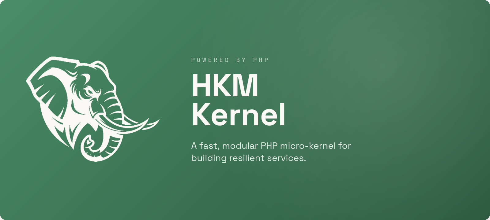

<p align="center">
  
</p>

<h1 align="center">HKM Kernel</h1>

<p align="center">
  <em>A modular <strong>PHP 8.4+</strong> service framework built on the <strong>Gated Demand Architecture (GDA)</strong>.<br>
  Security runs <em>before</em> any module loads, and only the modules a request actually needs are ever wired in.</em>
</p>

<p align="center">
  <a href="https://www.php.net/"></a>
  <a href="LICENSE"></a>
  
  
</p>

It ships as a **native cross-platform CLI** (`hkm`) built with Zig, so you install and
upgrade it like a Go/Rust binary — no Composer needed to get started.

---

## Table of contents

1. [Purpose](#purpose)
2. [What we're building toward](#what-were-building-toward)
3. [Project status — done vs. cooking](#project-status--done-vs-cooking)
4. [Why GDA?](#why-gda)
5. [Install](#install)
6. [The `hkm` CLI](#the-hkm-cli)
7. [Your first project](#your-first-project)
8. [Core concepts](#core-concepts)
9. [The request lifecycle](#the-request-lifecycle)
10. [Building a feature — end to end](#building-a-feature--end-to-end)
11. [The five access rules](#the-five-access-rules)
12. [Batteries included (plugins)](#batteries-included-plugins)
13. [Development from source](#development-from-source)
14. [Security defaults](#security-defaults)
15. [License](#license)

---

## Purpose

**HKM Kernel exists to make secure, cost-predictable PHP services the default — not the
reward for discipline.**

Most PHP frameworks boot the whole application, wire every service, and *then* decide what
the request needs. That is convenient, but it means an unauthenticated request that should
cost nothing still pays to construct half your app, and domain boundaries live only in your
head (and your code reviews).

HKM inverts that with the **Gated Demand Architecture**:

- **Security is the gate, not a middleware afterthought.** A `SecurityGateway` runs *before*
  any module is wired. A denied request costs *zero* module construction.
- **You pay only for what a route uses.** Modules are resolved from a per-request dependency
  graph and wired on demand. Nothing you didn't ask for is loaded.
- **Boundaries are enforced by the runtime, not by convention.** Cross-layer and
  cross-module access rules throw real exceptions, not lint warnings.

The goal is a framework where the *fast, secure, well-bounded* way to build something is also
the *easy* way — and where you can drop in a first-party plugin (auth, tenancy, mail, OAuth2)
without inheriting a monolith.

> **This is not Laravel, Symfony, or Slim.** It borrows none of their conventions — no
> globals, no facades, no runtime auto-discovery. Everything is explicit and injected.

---

## What we're building toward

The north-star goals that guide every decision in this repo:

| Goal | What it means |
|---|---|
| **Zero-cost denial** | A blocked request never constructs a module. Security is measured in the gateway, not the controller. |
| **Per-request minimalism** | The kernel wires exactly the modules a route needs — and their transitive dependencies — and nothing else. |
| **Runtime-enforced isolation** | One module, one domain. Modules cannot reach into each other's internals; the container throws if they try. |
| **A dependency-free kernel** | The core should carry no vendor coupling. Request/Response/uploads become pure value objects (see *cooking*, below). |
| **Infrastructure independence** | The kernel defines *ports*; the project supplies adapters (MySQL, Redis, S3, SMTP…). Swap them without touching domain code. |
| **Install like a binary** | `hkm` is a native cross-platform launcher — no Composer required to get started, upgradeable in place. |
| **Batteries, not a monolith** | Auth, Users, Tenancy, OAuth2, Mail, and more ship as opt-in first-party plugins, each owning exactly one domain. |

---

## Project status — done vs. cooking

> **Where things stand today.** HKM is under **active development**. The architecture and the
> core plugins are in daily use, and releases are cut regularly — but some subsystems are
> still stabilizing. This section is the honest map.

### ✅ Done & stable

- **The GDA kernel** — boot pipeline (10 fail-fast stages), security gateway, on-demand
  module loader, request-scoped DI with runtime scope enforcement, HTTP / CLI / Worker
  pipelines, domain + integration event system, and the port interfaces.
- **The five access rules**, enforced at runtime via `ModuleContainer::bindInternal()`.
- **Native distribution** — `hkm` launcher + `hkm-config` built with Zig; `.deb`, macOS
  `.app`, and Windows `.zip` bundles published automatically from `CHANGELOG.md`.
- **First-party plugins** (see [the full table](#batteries-included-plugins)) — Auth,
  User, Tenancy, OAuth2, Validation, Mail, Storage, Session/Cookie, HttpClient,
  SecurityFilters, I18n, View/ViteManifest/Pageflow.
- **Multi-project, multi-tenant hosting** — host-based `DomainResolver`, strict per-tenant
  DB routing, and a project-over-plugin resource resolution model.
- **Database & migrations** — the multi-driver `DatabasePort` (MySQL / PostgreSQL / SQLite /
  SQL Server) and the standalone **LetMigrate** engine (fluent schema, seeders, CLI).
- **Frontend federation** — per-project surfaces + `hkm ui` to mirror plugin UIs, with a
  Pageflow (Inertia-style) SPA bridge.

### 🍳 Still cooking

- **Dependency-free HTTP core.** The kernel's `Request`/`Response`/`UploadedFile` are
  *currently* built on `symfony/http-foundation` as a deliberate, temporary choice. They are
  being reimplemented as pure value objects so the kernel carries no vendor coupling. The
  kernel's own method surface (`$request->input()`, `Response::json()`, …) is the stable API —
  build against it and the switch will be non-breaking.
- **API surface hardening.** We're at the `1.0.x` line; some plugin contracts and config keys
  are still settling. Pin your version and read the [CHANGELOG](CHANGELOG.md) before upgrading.
- **Docs & guides.** The layer deep-dives in [`docs/guides/`](docs/guides/) are being expanded
  and turned into a proper documentation site.
- **Test & tooling coverage.** PHPStan (level 5) and the PHPUnit suite are wired as CI gates;
  coverage and static-analysis depth are still growing.

### 🗺️ On the roadmap

- Finish the dependency-free kernel and drop the transitional Symfony dependency.
- A public documentation site generated from the layer guides.
- More first-party adapters (queue backends, storage drivers, mail transports).
- Performance benchmarks published per release.

Found a gap or want to help? [Open an issue](https://github.com/AlfaCode-Team/hkm-kernel/issues)
or a discussion.

---

## Why GDA?

Most frameworks boot everything, then decide what to do. GDA inverts that:

| Principle | What it means in practice |
|---|---|
| **Security before everything** | A `SecurityGateway` runs before any module loads. A denied request costs *zero* module wiring. |
| **Load only what is needed** | Only the modules required for *this* route are registered — resolved from a dependency graph per request. |
| **One module, one domain** | Every module owns exactly one bounded business domain. No exceptions. |
| **Isolation by default** | Modules cannot touch each other's internals — request-scoped containers enforce this at **runtime**. |
| **Infrastructure independence** | The kernel defines *port* interfaces; the project supplies implementations (MySQL, Redis, S3, …). |
| **Explicit over implicit** | Everything is declared in `module.json`. Nothing is auto-discovered at runtime. |

The result: predictable performance (you pay only for what a route uses), strong domain
boundaries that hold at runtime, and infrastructure you can swap without touching business
code.

### The three worlds

```text
┌─────────────────────────────────────────────────┐
│  PROJECT LAYER   (wiring only — no business logic)│
│  ┌─────────────────────────────────────────────┐ │
│  │  MODULE / PLUGIN LAYER  (bounded domains)   │ │
│  │  ┌───────────────────────────────────────┐  │ │
│  │  │  KERNEL                               │  │ │
│  │  │  boot · security · loading · DI ·     │  │ │
│  │  │  pipelines · events · ports           │  │ │
│  │  └───────────────────────────────────────┘  │ │
│  └─────────────────────────────────────────────┘ │
└─────────────────────────────────────────────────┘
```

- **Kernel** — knows nothing about your domains. Changes rarely.
- **Module/Plugin** — knows nothing about the project. Wires to the kernel through contracts.
- **Project** — knows everything, contains no business logic. Pure wiring.

---

## Install

Download the latest build from
[Releases](https://github.com/AlfaCode-Team/hkm-kernel/releases/latest).

**Linux (Debian / Ubuntu / Kali)**
```bash
sudo apt install ./hkm-kernel_<version>_amd64.deb
hkm doctor        # verify PHP + extensions
```

**macOS** — extract `hkm-kernel-<version>-macos-universal.tar.gz`, then run
`HKM.app/Contents/Resources/opt/hkm-kernel/install.sh`.

**Windows** — extract `hkm-kernel-<version>-windows-x86_64.zip`, run
`hkm-kernel\install.bat`, and add the folder to `PATH`.

The launcher **self-locates** the kernel — no environment variables required on a standard
install. Runtime PHP dependencies are resolved with Composer on the target at install time,
so they match your exact PHP.

### Requirements (verified by `hkm doctor`)

- PHP **≥ 8.4.1**
- Extensions: `json, mbstring, ctype, tokenizer, filter, pdo, openssl, curl, fileinfo`
- At least one PDO driver: `mysql` · `pgsql` · `sqlite` · `sqlsrv`
- Optional: `redis`, `swoole`/`openswoole`, `gd`, `intl`

---

## The `hkm` CLI

| Command | Purpose |
|---|---|
| `hkm new <path> [--project=<name>]` | Scaffold a new project (secure defaults: `.env` chmod 600, Apache **+** nginx configs) |
| `hkm run [path\|name]` | Run a project locally (PHP dev server) |
| `hkm cli [command]` | Run a project's console interactively |
| `hkm worker [args]` | Run a project's queue worker |
| `hkm list` | List registered projects |
| `hkm plugins [path\|name]` | Analyse a project's enabled plugins/modules |
| `hkm module` | Inspect / update the first-party kernel packages |
| `hkm ui [sync\|list\|link\|clean]` | Federate enabled plugins' UIs into the frontend |
| `hkm doctor` | Diagnose PHP, extensions, and the resolved kernel path |
| `hkm-config` | Set up / repair the full environment (kernel + userdata) |
| `hkm upgrade [--check]` | Check for and install a newer release |
| `hkm version` / `--version` / `-v` | Show the banner + version |
| `hkm <command> --dev` | Run any command against the **development** kernel checkout |

### Environment (all auto-detected — override only for non-standard layouts)

| Variable | Meaning |
|---|---|
| `HKM_KERNEL_HOME` | Kernel root (`composer.json`, `vendor/`, `projects/`, `templates/`) |
| `HKM_DEV_HOME` | Development kernel checkout used by `--dev` (`hkm-config set-dev-home <path>`) |
| `HKM_USERDATA_DIR` | Persistent registry (`projects.json` + `platform.json`) that **survives updates** |
| `HKM_PHP_BIN` | Override the `php` binary |
| `HKM_CLI_PATH` / `HKM_GLOBAL_AUTOLOAD` | Override the PHP CLI script / kernel autoload |

Run `hkm-config` once and it pins `HKM_KERNEL_HOME` and provisions a persistent
`HKM_USERDATA_DIR` (migrating any existing registry) into `~/.config/hkm/config.env`.

---

## Your first project

```bash
# 1. Scaffold — creates a hardened project skeleton
hkm new ~/apps/shop --project=shop

# 2. Verify the environment
hkm doctor

# 3. Run it locally
hkm run shop
#   → serving http://127.0.0.1:8000  (docroot pinned to app/public)

# 4. Console + queue worker for the same project
hkm cli shop migrate            # run migrations (LetMigrate)
hkm worker shop                 # drain the job queue
```

A project is **wiring only**. Its bootstrap composes the kernel from a shared base and
declares which plugins it activates:

```php
// projects/shop/bootstrap/app.php
/** @var Kernel $builder */
$builder = require __DIR__ . '/../../../app/bootstrap/base.php';

return $builder
    ->withProjectPath(dirname(__DIR__))
    ->withModules([
        Plugins\Auth\Provider::class,
        Plugins\User\Provider::class,
        Plugins\Task\Provider::class,
    ])
    ->build();
```

Incoming requests are mapped to a project by **host** (`app.example.com` → the `shop`
project) via `DomainResolver`, falling back to the `HKM_PROJECT` env var, then `admin`.

---

## Core concepts

### Modules & plugins

A **plugin** (local business module) lives under `plugins/<Name>/`, uses the `Plugins\<Name>\`
namespace, and follows a strict GDA folder layout:

```
plugins/Invoice/
├── module.json                              ← single source of truth
├── API/Contracts/InvoiceServiceContract.php ← the ONLY thing other modules may import
├── Domain/                                  ← entities, value objects, domain events (zero external imports)
├── Application/Services/InvoiceService.php  ← transaction + event orchestration
├── Infrastructure/
│   ├── Persistence/InvoiceRepository.php    ← DatabasePort only
│   ├── Gateways/StripeGateway.php           ← vendor SDK only
│   └── Http/Controllers/InvoiceController.php ← ≤3-line actions
└── Provider.php                             ← implements ModuleContract
```

### `module.json` — the single source of truth

Routes, config, dependencies, and emitted events are **declared**, never discovered:

```json
{
  "name": "invoice",
  "solves": "invoice.generation",
  "type": "module",
  "requires": ["database.query"],
  "exposes": ["InvoiceServiceContract"],
  "routes": [
    { "method": "GET",  "path": "/api/invoices",      "handler": "InvoiceController@index" },
    { "method": "POST", "path": "/api/invoices",      "handler": "InvoiceController@create", "filters": ["auth", "throttle:60,1"] },
    { "method": "GET",  "path": "/api/invoices/{id}", "handler": "InvoiceController@show" }
  ],
  "emits": ["invoice.created", "invoice.paid"],
  "config": ["INVOICE_CURRENCY", { "key": "INVOICE_TAX_RATE", "type": "float", "required": false }]
}
```

If a module reads an env var that isn't in `config[]`, **boot fails** — no silent misconfig.

### Ports (infrastructure independence)

The kernel defines interfaces; the project binds implementations once, at the app-lifetime
container:

```php
->withPorts([
    DatabasePort::class => new MySQLAdapter(config('database')),
    CachePort::class    => new RedisAdapter(config('cache')),
    QueuePort::class    => new RedisQueueAdapter(config('jobs')),
    MailPort::class     => new SmtpMailAdapter(config('mail')),
    StoragePort::class  => new S3StorageAdapter(config('storage')),
])
```

Swap MySQL for Postgres, or SMTP for SES, without touching a single line of domain code.

---

## The request lifecycle

```text
Request
  │
  ▼  SecurityGateway  (runs BEFORE any module loads)
  │   Firewall → RateLimiter → CSRF → [your Auth layer]   ── deny = zero module cost
  ▼
HTTP pipeline
  1. CorrelationIdStage   propagate X-Correlation-ID
  2. SecurityStage        run the gateway, attach Identity
  3. ResolveStage         route-manifest lookup → service name
  4. LoadStage            build dependency graph → wire ONLY those modules
     ↳ RouteFilterStage   run the route's declared filters[] (auth, throttle, …)
  5. ExecuteStage         contract → DTO → controller → Response
  6. ErrorStage (wraps all) classify → notify (Slack/Mail/DB/File) → HTTP response
```

Every stage is `handle(Request $request, callable $next): Response`. Modules add
cross-cutting behaviour by registering hooks in `Provider::boot()`, or opt individual routes
into named **filters** via `module.json`.

---

## Building a feature — end to end

A complete vertical slice. Each layer has one job and may only talk to the layer below it.

### 1. Domain — pure, zero external imports

```php
// Domain/ValueObjects/Money.php
final readonly class Money
{
    private function __construct(private int $amount, private string $currency) {   // integer cents — NEVER float
        if ($this->amount < 0) throw new \DomainException('Money cannot be negative');
    }
    public static function of(int|float $amount, string $currency): self {
        return new self((int) round($amount * 100), strtoupper($currency));
    }
    public function add(self $o): self {
        if ($this->currency !== $o->currency) throw new \DomainException('Currency mismatch');
        return new self($this->amount + $o->amount, $this->currency);   // operations return NEW instances
    }
    public function amount(): int { return $this->amount; }
}
```

### 2. Service — transaction + event orchestration (the mandatory shape)

```php
final class InvoiceService implements InvoiceServiceContract
{
    public function __construct(
        private readonly InvoiceRepository    $repository,
        private readonly TransactionManager   $transaction,
        private readonly DomainEventCollector $collector,
        private readonly EventBus             $eventBus,
        private readonly Identity             $identity,     // from the SecurityGateway
    ) {}

    public function create(CreateInvoiceDTO $dto): InvoiceResponseDTO
    {
        // authorization first
        if (!$this->identity->hasPermission('invoice:create')) {
            throw new ServiceException('invoice.unauthorized', layer: 'service.invoice');
        }

        $this->collector->beginCollection();
        $this->transaction->begin();
        try {
            $invoice = Invoice::create(ClientId::from($dto->clientId), Money::of($dto->amount, 'USD'));
            foreach ($invoice->releaseEvents() as $e) $this->collector->collect($e);
            $this->repository->save($invoice);
            $this->transaction->commit();
        } catch (\Throwable $e) {
            $this->transaction->rollback();
            $this->collector->discard();                     // ALWAYS — no phantom events on rollback
            throw new ServiceException('invoice.create.failed', layer: 'service.invoice', previous: $e);
        }

        // integration events dispatch ONLY after a successful commit — never inside try{}
        $this->eventBus->dispatch(new InvoiceCreatedIntegrationEvent($invoice->id()->value(), $dto->amount));

        return InvoiceResponseDTO::from($invoice);
    }
}
```

### 3. Repository — `DatabasePort` only, translate every `\PDOException`

```php
final class InvoiceRepository
{
    public function __construct(private readonly DatabasePort $db, private readonly Identity $identity) {}

    public function find(string $id): Invoice
    {
        try {
            $row = $this->db->queryOne(
                'SELECT * FROM invoices WHERE id = :id AND tenant_id = :t AND deleted_at IS NULL',
                ['id' => $id, 't' => $this->identity->tenantId],     // ALWAYS tenant-scoped
            );
        } catch (\PDOException $e) {
            throw new RepositoryException("find invoice [$id]", layer: 'repository.invoice', previous: $e);
        }
        return $row ? InvoiceHydrator::hydrate($row) : throw new RepositoryException("Invoice [$id] not found");
    }
}
```

### 4. Controller — ≤3 lines: DTO → service → Response

```php
final class InvoiceController
{
    public function __construct(private readonly InvoiceServiceContract $service) {}   // contract only

    public function create(Request $request): Response
    {
        $dto = CreateInvoiceDTO::fromRequest($request);   // validation happens here
        return Response::json($this->service->create($dto)->toArray(), 201);
    }
}
```

### 5. Provider — wire it together

```php
class Provider implements ModuleContract
{
    public function solves(): string  { return 'invoice.generation'; }
    public function requires(): array { return [DatabasePort::class]; }
    public function exposes(): array  { return [InvoiceServiceContract::class]; }

    public function register(ModuleContainer $c): void
    {
        $c->bindInternal(InvoiceRepository::class, fn($c) =>
            new InvoiceRepository($c->make(DatabasePort::class), $c->make(Identity::class)));

        $c->bind(InvoiceServiceContract::class, fn($c) => new InvoiceService(
            $c->make(InvoiceRepository::class), $c->make(TransactionManager::class),
            $c->make(DomainEventCollector::class), $c->make(EventBus::class), $c->make(Identity::class),
        ));
    }

    public function boot(HttpPipeline $http, CliPipeline $cli, WorkerPipeline $worker, EventBus $events): void
    {
        // $events->subscribe('payment.succeeded', MarkInvoicePaidListener::class);
    }
}
```

Add `Plugins\Invoice\Provider::class` to a project's `withModules([...])` and the routes,
config validation, and DI are live.

### Testing — always fakes, never real infrastructure

```php
$sut = new InvoiceService(
    new InMemoryInvoiceRepository(), new FakeTransactionManager(),
    new DomainEventCollector(), $bus = new FakeIntegrationEventBus(), Identity::asUser('u-1', 'tenant-a'),
);
$result = $sut->create($validDto);

$bus->assertDispatched(InvoiceCreatedIntegrationEvent::class, times: 1);
$this->assertNotNull($result->invoiceId);
```

---

## The five access rules

These are **enforced at runtime** by `ModuleContainer::bindInternal()` — a violation throws
`ScopeViolationException`, not a lint warning.

```text
Controller  →  Service      (published contract interface ONLY)
Service     →  Repository AND Gateway   (the ONLY layer that may call both)
Repository  →  DatabasePort ONLY        (no HTTP, no vendor SDK)
Gateway     →  Vendor SDK ONLY          (no DB, no services)
Domain      →  NOTHING EXTERNAL         (zero imports outside Domain/)
```

**Never** (a partial list the framework actively rejects):
- Routes defined in PHP — only in `module.json` / `proj.json`.
- `float` for money — use a `Money` value object with integer cents.
- Vendor exceptions (`\PDOException`, Stripe, …) escaping their layer — translate them.
- Integration events dispatched inside a `try{}` — only after commit.
- Another module's internal class imported — use its published contract.
- `getenv()` for a `.env` value — use the `env()` helper.
- Business logic in a controller — max 3 lines.

---

## Batteries included (plugins)

Drop-in modules under `plugins/`, activated per project:

| Plugin | Domain | What you get |
|---|---|---|
| **Auth** | `auth.identity` | JWT / PAT / session issuance + verification, refresh-token rotation, guards |
| **OAuth2** | `oauth.server` | Native OAuth 2.1 + OIDC server (auth code + PKCE, device code, JWKS, introspection) |
| **User** | `user.management` | Central identity store, email verification, transactional outbox, audit log |
| **Tenancy** | `tenancy.routing` | Multi-tenant DB routing, memberships, invitations, per-tenant isolation |
| **Validation** | `validation.rules` | Request validation engine + `AbstractDto` (`rules()`), ~45 built-in rules |
| **Mail** | `mail.delivery` | Native dependency-free mailer — SMTP/Sendmail/`mail()`, DKIM, attachments |
| **Storage** | `storage.local` | `StoragePort` over local disk **or** S3 (Flysystem), signed temp URLs |
| **Session / Cookie** | `session.management` / `http.cookies` | Encrypted sessions, flash, CSRF; queued encrypted cookies |
| **HttpClient** | `http.client` | `HttpClientPort` (cURL) with idempotent-safe retries + coroutine backoff |
| **View / ViteManifest / Pageflow** | frontend | PHP templating, Vite asset resolution, Inertia-style SPA bridge |
| **SecurityFilters** | `http.security_filters` | CORS + secure headers; route-filter aliases `auth`, `throttle`, `hmac`, `shield` |
| **I18n** | `i18n.translation` | File-based translator, pluralization, `Accept-Language` negotiation |

Each plugin ships its own `README.md` — e.g. [Auth](plugins/Auth/README.md),
[Tenancy](plugins/Tenancy/README.md), [User](plugins/User/README.md),
[OAuth2](plugins/OAuth2/README.md).

---

## Development from source

```bash
git clone --recurse-submodules git@github.com:AlfaCode-Team/hkm-kernel.git
cd hkm-kernel
composer install                           # also wires the git hooks (core.hooksPath=.githooks)
vendor/bin/phpunit                         # run the test suite

# If you skip composer, enable the repo git hooks manually (strips AI co-author
# trailers from commit messages):
git config core.hooksPath .githooks

# Build the native launcher (needs Zig — see tools/.zig-version):
cd tools && zig build --release=small      # → ../bin/hkm + ../bin/hkm-config
```

### Building release bundles

```bash
VERSION=1.2.3 ./tools/bundle.sh all         # .deb + macOS .app + Windows .zip → dist/
# MODULES=git ./tools/bundle.sh linux       # fetch path-repo modules from pinned commits
```

Releases are cut by pushing a `v*` tag — CI runs the test suite first, then builds all three
OS bundles and publishes them automatically.

### Releasing (branch model + automation)

Development happens on the **`master`** dev branch; **`main`** is the stable release branch.
Releases are **CHANGELOG-driven and automatic** — you never tag by hand.

1. Do your work on `master` and commit.
2. Add a new `## [x.y.z] - YYYY-MM-DD` section to [`CHANGELOG.md`](CHANGELOG.md)
   (below `## [Unreleased]`), describing the changes.
3. Open a PR `master` → `main` and merge it.
4. On merge, the **Auto Release** workflow ([`.github/workflows/auto-release.yml`](.github/workflows/auto-release.yml))
   reads the top CHANGELOG version and, if no `vX.Y.Z` tag exists yet, creates the tag and
   calls the **Release** workflow — which runs the test gate, builds all OS bundles, and
   publishes the GitHub Release (notes pulled from that CHANGELOG section).

Notes:
- A release only starts when the merge changes `CHANGELOG.md` **and** introduces a version
  not already tagged — ordinary merges don't publish anything.
- No secret/PAT is required: Auto Release invokes the Release workflow directly via
  `workflow_call`.
- You can still cut a release manually at any time by pushing a `v*` tag.

For deep dives, see the layer guides in [`docs/guides/`](docs/guides/) and the
[CHANGELOG](CHANGELOG.md).

---

## Security defaults

Scaffolded projects are hardened out of the box:

- `.env` is `chmod 600`; debug output is force-disabled when `APP_ENV=production`.
- Every project ships web-server configs (`app/public/.htaccess`,
  `app/apache.conf.example`, `app/nginx.conf.example`) pinning the docroot to `app/public`,
  denying dotfiles, and adding baseline security headers.
- The `SecurityGateway` (firewall → rate limiter → CSRF → your auth layer) runs before any
  module — denied requests never touch business code.
- Keep secrets (`APP_KEY`, JWT signing keys, DB credentials) out of the CLI config and,
  in production, behind a `SECRETS_PROVIDER`.

---

## License

MIT — see [LICENSE](LICENSE).
